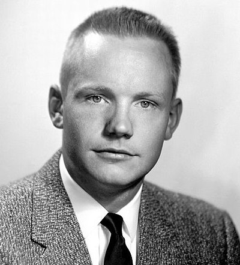

# Oneline (TSP) Image
picks random points from an image and solves the traveling salesman problem then joins it through turtle.
similar to [this](https://fronkonstin.com/2018/04/04/the-travelling-salesman-portrait/).

## How to use:
change file name 
```
image = Image.open('neil.jpg')
```
and tweak size and other parameters to your liking then go ahead and run.

## Example



## Dependencies (py packages)
* turtle
* pillow
* numpy + scipy
* tsp_solver

---
This is an old project and is no longer maintained so I do not know what happened since.
